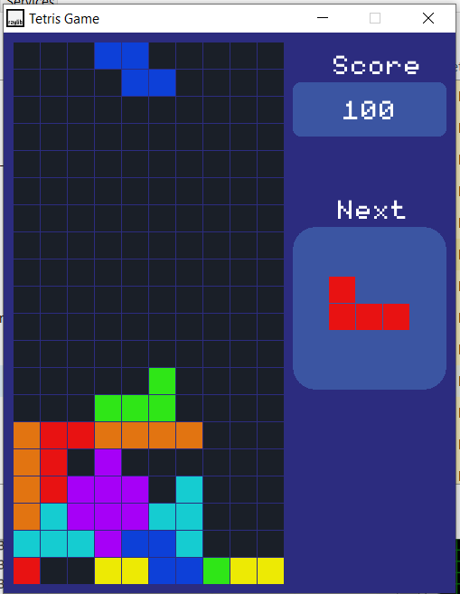

# tetris_game_using_raylib_CPP

Tried to replicate the classic Tetris game

- Double Click on main.code-workspace to open this folder in VSCode
in src folder click on main.cpp
- click F5 ( or Function + F5 ) to run the code.
